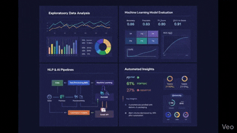

<h1 align="center">Hi 👋, I'm Shashank Kumar</h1>
<h3 align="center">
Data Analyst | Business Intelligence | SQL • Python • Power BI
</h3>

  

📊 Turning data into actionable business insights  
🤖 Analytics + Automation | Manufacturing • Healthcare • Operations

🌐 <a href="https://shashank-014.github.io">Portfolio</a> •
📄 <a href="https://shashank-014.github.io/resume.pdf">Resume</a> •
💼 <a href="https://linkedin.com/in/shashankkumar14">LinkedIn</a>

---

## 👨‍💻 About Me

- 📊 **Data Analyst** with hands-on experience in **SQL-driven analysis, Python-based EDA, and Power BI dashboards**
- 🏭 Worked on **real-world analytics projects** across manufacturing, healthcare, finance, and operations
- 📈 Experienced in **data cleaning, modeling, KPI reporting, and data storytelling**
- 🤖 Built **AI-powered automation workflows** using n8n and LLMs to reduce manual effort
- 🎓 Currently pursuing **MS in Computer Science (AI & Machine Learning)**

---

## 🧰 Tech Stack

**Data & Analytics**
- SQL (PostgreSQL, MySQL), Python (Pandas, NumPy)
- Power BI (DAX, Data Modeling), Excel, Tableau
- Exploratory Data Analysis (EDA), KPI Reporting

**Automation & AI**
- n8n, LLMs (Gemini), NLP
- Workflow Automation, Event-driven pipelines

**Tools**
- GitHub, Jupyter Notebook, Google Colab

---

## 🚀 Featured Projects

### 📊 Manufacturing & Workforce Analytics Dashboard
**End-to-end Power BI analytics project (500K+ records)**

- Cleaned and modeled large manufacturing & workforce datasets
- Designed **10+ relational tables** and built **25+ DAX measures**
- Improved reporting efficiency by **~40%** and data accuracy by **~20%**
- **Tech:** Power BI, SQL, Excel, DAX  
🔗 https://github.com/shashank-014/manufacturing-workforce-analytics-powerbi

---

### 🏥 Pandemic Patterns: COVID-19 Healthcare Analytics (India)
**SQL + Excel analytics pipeline on public health data**

- Integrated **100K+ records** across cases, testing, and vaccination datasets
- Built SQL-based ETL workflows and applied **ETS time-series forecasting**
- Developed an interactive Excel dashboard for public health insights
- **Tech:** SQL, Excel, Forecasting  
🔗 https://github.com/shashank-014/pandemic-patterns-covid19-analytics

---

### 🔐 AI-Powered Security Alert Automation System
**LLM-driven alert classification and automation**

- Built an AI-based alert classification system with **80%+ accuracy**
- Automated alert routing via email & webhooks
- Reduced manual triage effort by **~70%**
- **Tech:** Python, n8n, LLMs  
🔗 https://github.com/shashank-014/ai-security-alert-system-n8n

---

## 📌 What I’m Looking For

- 📊 **Data Analyst / BI Analyst / Analytics roles**
- 🏢 Teams working on **data-driven decision-making**
- 🚀 Environments where analytics meets real business impact

---

## 🤝 Let’s Connect

  
  
  

---

⭐ If you find my work useful, feel free to star the repositories!

